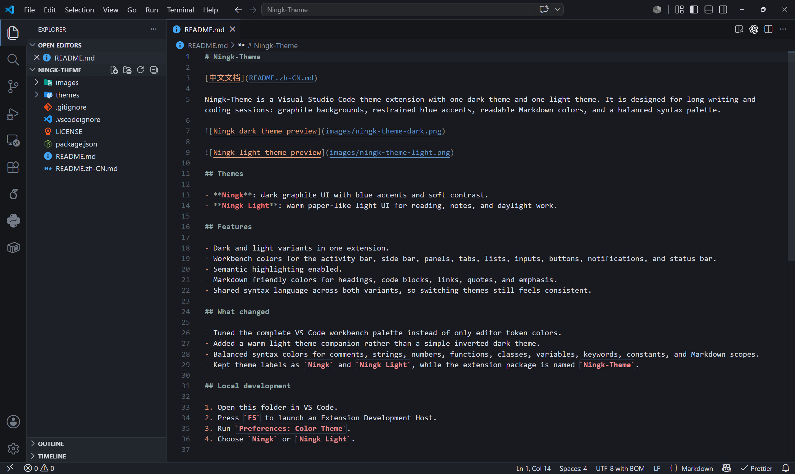
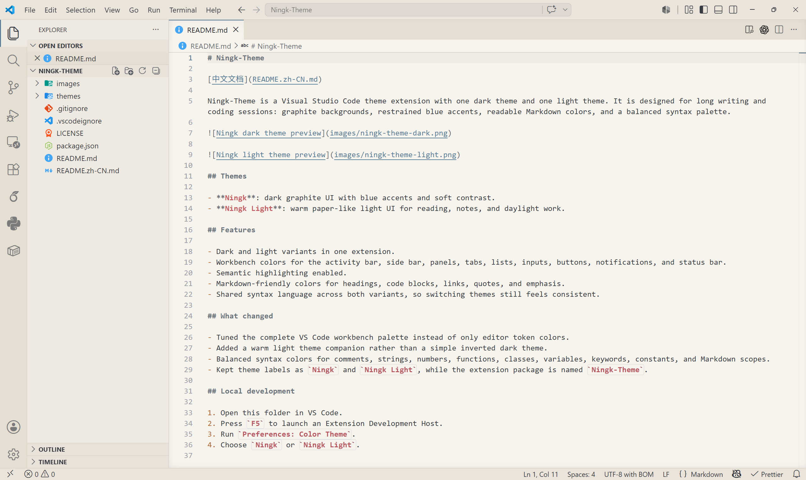

# Ningk-Theme

[中文文档](README.zh-CN.md)

Ningk-Theme is a Visual Studio Code theme extension with one dark theme and one light theme. It is designed for long writing and coding sessions: graphite backgrounds, restrained blue accents, readable Markdown colors, and a balanced syntax palette.

## Themes

- **Ningk**: dark graphite UI with blue accents and soft contrast.
- **Ningk Light**: warm paper-like light UI for reading, notes, and daylight work.

## Features

- Dark and light variants in one extension.
- Workbench colors for the activity bar, side bar, panels, tabs, lists, inputs, buttons, notifications, and status bar.
- Semantic highlighting enabled.
- Markdown-friendly colors for headings, code blocks, links, quotes, and emphasis.
- Shared syntax language across both variants, so switching themes still feels consistent.

## What changed

- Tuned the complete VS Code workbench palette instead of only editor token colors.
- Added a warm light theme companion rather than a simple inverted dark theme.
- Balanced syntax colors for comments, strings, numbers, functions, classes, variables, keywords, constants, and Markdown scopes.
- Kept theme labels as `Ningk` and `Ningk Light`, while the extension package is named `Ningk-Theme`.
